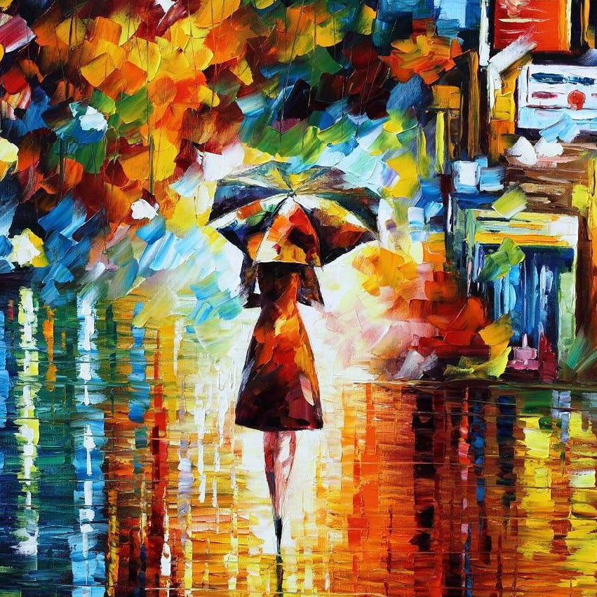
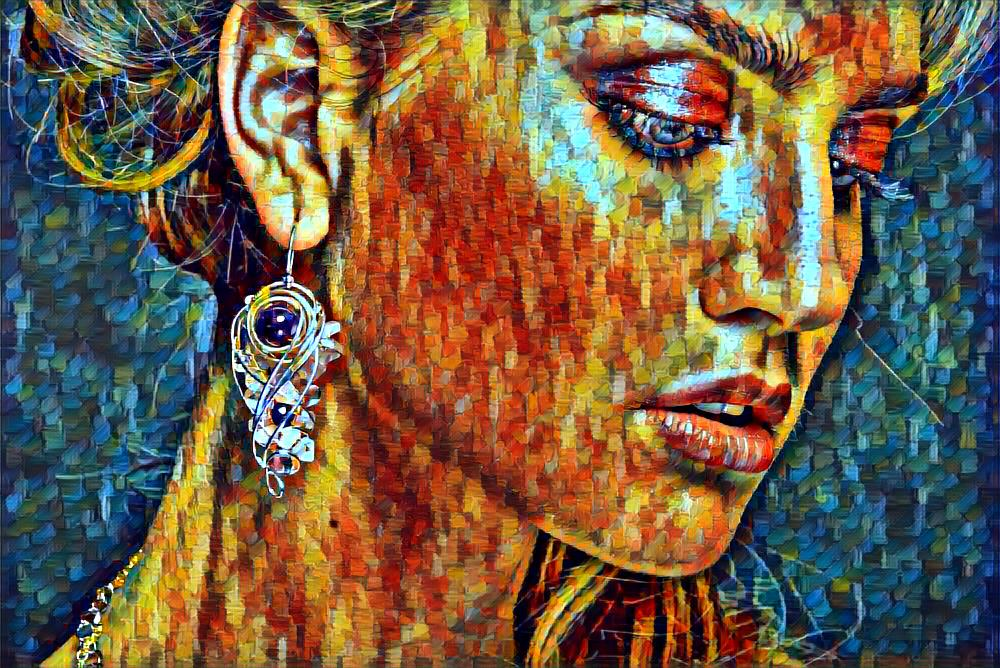

## Style-Transfer-Bot 

This repository contains Telegram Bot code that implements a quick style transfer to your photo.
User have 2 options: use build-in styles or upload own image of style.

Below you can find result of build-in style options applied.

          

  
  
   
  
  
   
  
  
   
  
  

## Models

In the original version of the [NST](), training process starts over and over again from scratch every time when we get new content and style images. It takes a lot of time of waiting. 

The main goal - is to make waiting time as short as possible. I found two options [MSG-Net](https://arxiv.org/pdf/1703.06953.pdf) and [Perceptual Losses for Real-Time Style Transfer and Super-Resolution](https://arxiv.org/abs/1603.08155). Bot uses pretrained models based on the user's own style image or build-in options.

For user's own style image bot uses [MSG-Net](https://arxiv.org/pdf/1703.06953.pdf) as the network that performs style transfer.
MSG-Net is trained on a large number of content pictures and 21 style pictures. Eventually the network learned to copy not only these styles, but any (or almost any) other. According to the paper a larger number of style pictures (100 or 1000) during training do not change the result. In fact, the network learns "brushes" and "palettes", and then tries to correlate all this and apply in each case. MSG-Net implementation is taken from here (https://github.com/zhanghang1989/PyTorch-Multi-Style-Transfer).

User can also choose one of the proposed style by bot. 
Model used for build-in options is described in [Perceptual Losses for Real-Time Style Transfer and Super-Resolution](https://arxiv.org/abs/1603.08155) along with [Instance Normalization](https://arxiv.org/pdf/1607.08022.pdf). Implementation is a part of the [pytorch examples](https://github.com/pytorch/examples/tree/master/fast_neural_style) repository. 

All used models can be downloaded from models folder.

## Bot

For bot implementation [aiogram](https://docs.aiogram.dev/en/latest/index.html) was used as the main framework.
Aiogram allows processing requests from multiple users simultaneously - asynchrony.

The entire code of the bot itself is located in the module [main.py](https://github.com/t0efL/Style-Transfer-Telegram-Bot/blob/master/main.py).

**Before running the code, make sure that you get your own token from BotFather and specify it in the file main.py.**
I got a unique token for my bot via `@BotFather`.

## Deploy

I use free Heroku dyno for deployment of the bot. Due to the memory limits of the free dyno, bot have to resize the incoming images to the smaller size. Otherwise, model consumes too much memory.

## Requirements

[pytorch](http://pytorch.org/)
  
[scipy](https://www.scipy.org) 
  
[aiogram](https://docs.aiogram.dev/en/latest/index.html) `$ pip install -U aiogram`

## Usage
Stylize image:

Upload the content photo to the Telegram Bot and wait for the furthur instructions. It's pretty user-friendly.
