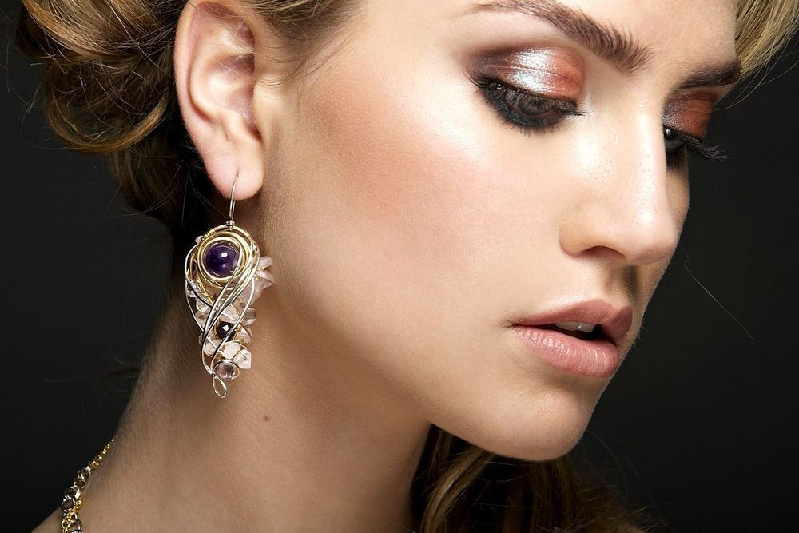
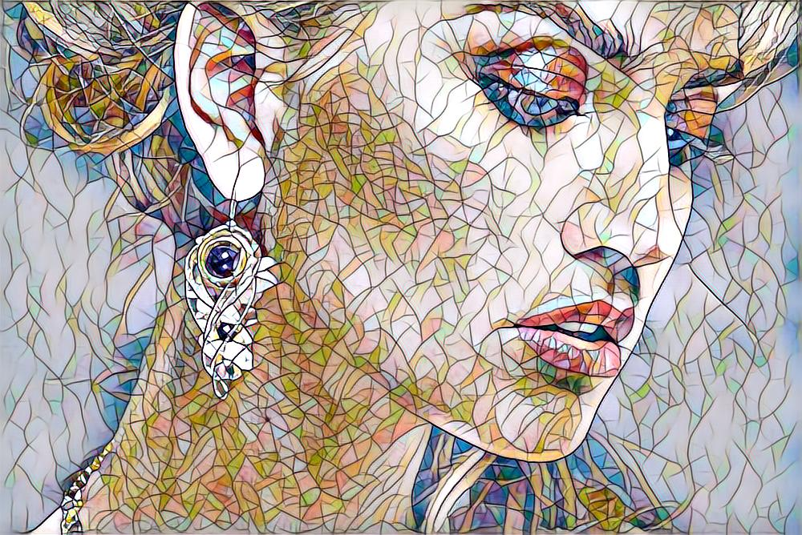
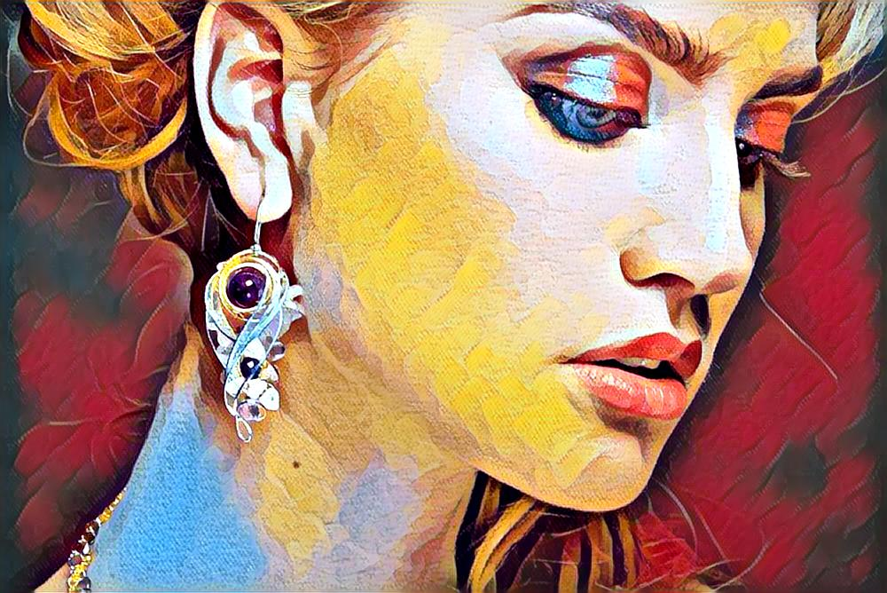
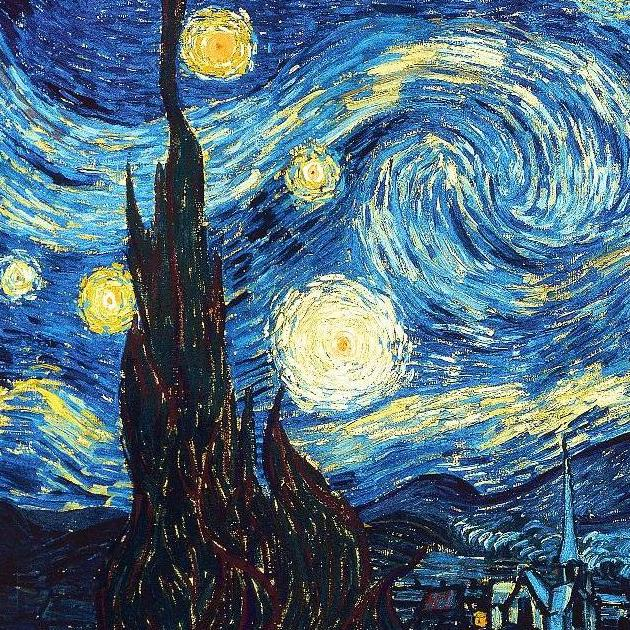
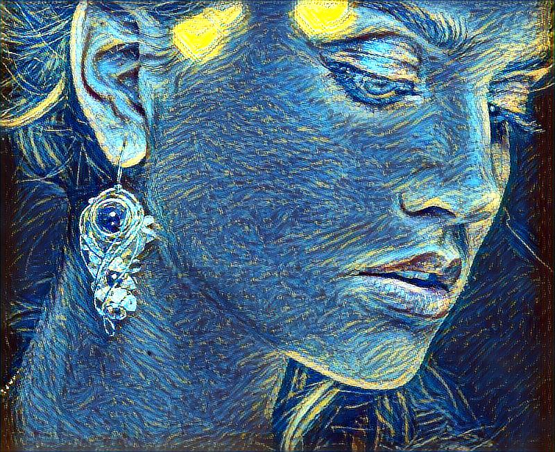
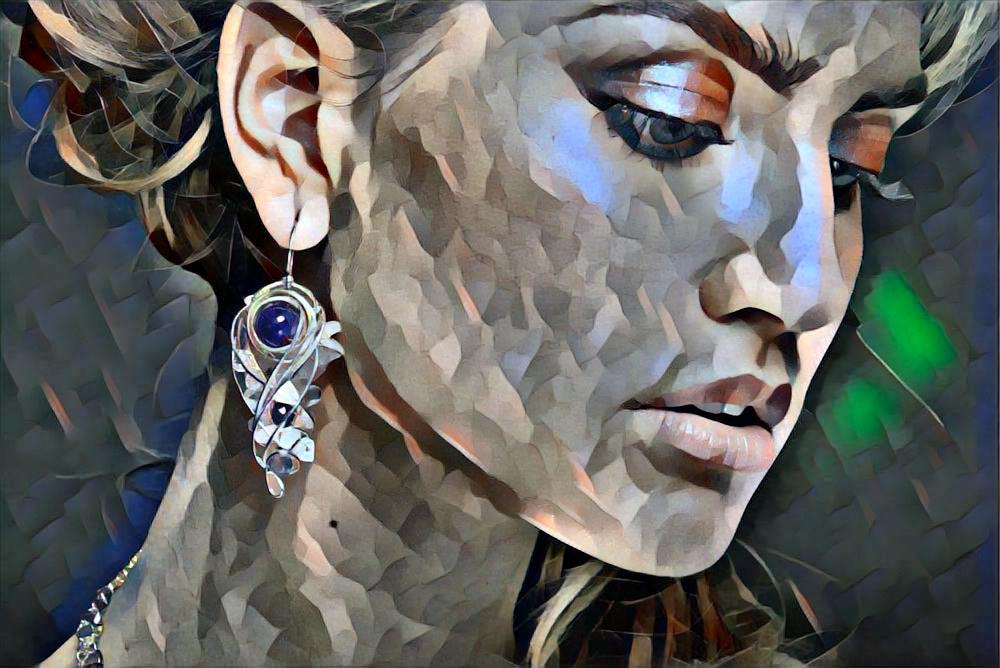

## Style-Transfer-Bot (aka Totoshka) 

This repository contains Telegram Bot code that implements a quick style transfer to your photo.
User have 2 options: use build-in styles or upload own image of style.
Totoshka Bot is the capstone project for the course [Deep Learning School by MIPT](https://en.dlschool.org/).

Below you can find result of build-in options applied.

          

  
  
   
  
  
   
  
  
   
  
  

## Models

In the original version of the [NST](), we train the resulting image itself in order to minimize the loss after the feature extractor, using the Gram matrix. As we don't pretrain model we cannot use model weights it for the new images furtur. Basically training process starts over and over again from scratch every time when we get new content and style images. It takes a lot of time of waiting from Bot user's side. 

The main goal of the user services - is to make waiting time as short as possible. With that reason in this project I try to use different models which minimize the same exact loss in the same way, but training the network itself. I found two options here [MSG-Net](https://arxiv.org/pdf/1703.06953.pdf) and [Perceptual Losses for Real-Time Style Transfer and Super-Resolution](https://arxiv.org/abs/1603.08155). Bot uses there pretrained models based on user's choice of tranfering own style or build-in options. It's just disire to try different ones. Technically one model could be used for both own style and build-in options though.

For user's own style image bot uses [MSG-Net](https://arxiv.org/pdf/1703.06953.pdf) as the network that performs style transfer.
MSG-Net is trained on a large number of content pictures and 21 style pictures. But in the end, the network learned to copy not only these styles, but any (or almost any) other. According to the research of the authors of the article, a larger number of educational style pictures (100 or 1000) do not change the result. In fact, the network learns "brushes" and "palettes", and then tries to correlate all this and apply in each case. MSG-Net implementation is taken from here (https://github.com/zhanghang1989/PyTorch-Multi-Style-Transfer).

In addition to uploading your picture, you can choose one of the proposed style. For this you need to follow the prompts of Bot.
Model used for build-in options is described in [Perceptual Losses for Real-Time Style Transfer and Super-Resolution](https://arxiv.org/abs/1603.08155) along with [Instance Normalization](https://arxiv.org/pdf/1607.08022.pdf). Implementation is a part of the [pytorch examples](https://github.com/pytorch/examples/tree/master/fast_neural_style) repository. 

All used models can be downloaded from models folder.

## Bot

You can find bot at Telegram @Totoshka 

For bot implementation I use [aiogram](https://docs.aiogram.dev/en/latest/index.html) as the main framework for writing the bot.
Aiogram allows processing requests from multiple users simultaneously - asynchrony.

The entire code of the bot itself is located in the module [main.py](https://github.com/t0efL/Style-Transfer-Telegram-Bot/blob/master/main.py).

**Before running the code, make sure that you get your own token from BotFather and specify it in the file main.py.**
I got a unique token for my bot via `@BotFather`.

## Deploy

I use AWS for deployment the bot - mostly due to the fact that AWS allocates the most RAM among others services. Heroku could be easier though.

[Here](https://github.com/hse-aml/natural-language-processing/blob/master/AWS-tutorial.md) is a pretty good tutorial for AWS.

## Requirements

[pytorch](http://pytorch.org/)
[scipy](https://www.scipy.org). 
[aiogram] `$ pip install -U aiogram`

## Usage
Stylize image:

Upload the content photo to the Telegram Bot and wait for the furthur instructions. It's pretty user-friendly.

